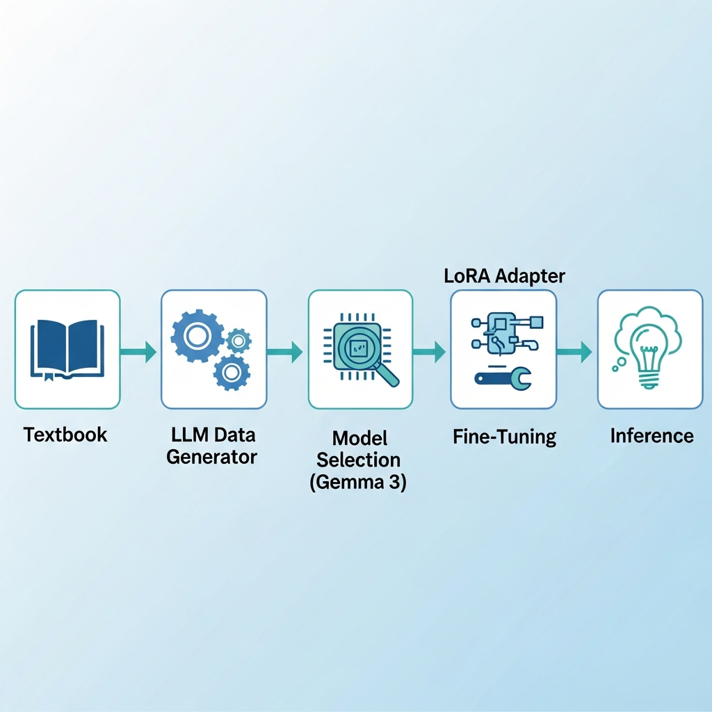

# 🚀 Fine-Tuning Gemma 3 with LoRA

<div align="center">

[](https://www.kaggle.com/)
[](https://drive.google.com/file/d/1N63GVduHTblHk4av87-pupsQZLTq32o6/view?usp=sharing)
[](https://medium.com/@mezzihoussem/fine-tuning-gemma-3-270m-or-higher-on-cpu-gpu-with-lora-and-keras-a-complete-guide-3675eb8a1ae6)
[](https://www.python.org/)
[](https://keras.io/)

**A comprehensive guide to fine-tuning Google's Gemma 3 models using LoRA (Low-Rank Adaptation) - works on both CPU and GPU!**

📖 **Read the full tutorial on Medium**: [Fine-Tuning Gemma 3 270M (or Higher) on CPU/GPU with LoRA and Keras: A Complete Guide](https://medium.com/@mezzihoussem/fine-tuning-gemma-3-270m-or-higher-on-cpu-gpu-with-lora-and-keras-a-complete-guide-3675eb8a1ae6)

</div>

---

## 📖 About This Project

This tutorial demonstrates how to fine-tune **Gemma 3 270M** (or higher) on a custom dataset using **LoRA** - a parameter-efficient fine-tuning technique that makes training accessible on consumer hardware.

### ✨ Key Features

- 🖥️ **CPU-Friendly**: Fine-tune models without expensive GPUs
- ⚡ **GPU-Compatible**: Same code works with CUDA for faster training
- 📊 **Complete Pipeline**: From data creation to model deployment
- 🎯 **Domain Adaptation**: Example with radiobiology Q&A dataset
- 🔧 **Production-Ready**: Save and deploy your fine-tuned models

---

## 🏗️ Architecture

<div align="center">



</div>

The LoRA approach freezes the pre-trained model weights and injects trainable low-rank decomposition matrices, dramatically reducing the number of trainable parameters.

---

## 🚀 Quick Start

### Option 1: Google Colab (Recommended)
Click the "Open in Colab" badge above or [open directly in Colab](https://drive.google.com/file/d/1N63GVduHTblHk4av87-pupsQZLTq32o6/view?usp=sharing) to run the notebook with free GPU access!

### Option 2: Kaggle
Run the notebook directly on Kaggle with free GPU/TPU access!

### Option 3: Local Installation

```bash
# Clone the repository
git clone https://github.com/ElHadheqMind/Fine-Tuning-Gemma-3.git
cd Fine-Tuning-Gemma-3

# Install dependencies
pip install keras-hub keras pandas numpy

# For GPU support (NVIDIA)
pip install keras-hub[jax] jax[cuda12]
```

---

## 📚 What You'll Learn

1. **📊 Data Creation** - Generate training data using LLM-DATA-Generator
2. **🔧 Model Setup** - Load and configure Gemma 3 with KerasHub
3. **🎛️ LoRA Configuration** - Apply parameter-efficient fine-tuning
4. **📈 Training** - Optimize hyperparameters and monitor progress
5. **🧪 Evaluation** - Compare before/after performance
6. **💾 Deployment** - Save and use your fine-tuned model

---

## 💻 Hardware Requirements

| Hardware | Gemma 3 270M | Gemma 3 1B | Gemma 3 4B |
|----------|--------------|------------|------------|
| **CPU** | ✅ ~2-4 hours | ⚠️ Slow | ❌ Not recommended |
| **GPU 8GB** | ✅ ~10 min | ✅ ~30 min | ⚠️ Tight fit |
| **GPU 16GB+** | ✅ ~5 min | ✅ ~15 min | ✅ ~45 min |

---

## 📁 Project Structure

```
Fine-Tuning-Gemma-3/
├── Fine_Tuning_Gemma3_LoRA.ipynb  # Main tutorial notebook
├── data.csv                        # Sample training data
├── Architecture.png                # Architecture diagram
└── README.md                       # This file
```

---

## 🤝 Contributing

Contributions are welcome! Feel free to:
- 🐛 Report bugs
- 💡 Suggest features
- 🔀 Submit pull requests

---

## 📚 Resources

- 📖 **Medium Article**: [Fine-Tuning Gemma 3 270M (or Higher) on CPU/GPU with LoRA and Keras: A Complete Guide](https://medium.com/@mezzihoussem/fine-tuning-gemma-3-270m-or-higher-on-cpu-gpu-with-lora-and-keras-a-complete-guide-3675eb8a1ae6)
- 🔗 **LLM-DATA-Generator**: [ElHadheqMind/LLM-DATA-Generator](https://github.com/ElHadheqMind/LLM-DATA-Generator)
- 🔗 **Gemma Models on Kaggle**: [kaggle.com/models/keras/gemma3](https://www.kaggle.com/models/keras/gemma3)
- 🔗 **KerasHub Documentation**: [keras.io/keras_hub](https://keras.io/keras_hub/)
- 🔗 **LoRA Paper**: [arxiv.org/abs/2106.09685](https://arxiv.org/abs/2106.09685)

---

## 🙏 Acknowledgments

- [Google DeepMind](https://deepmind.google/) for the Gemma models
- [Keras Team](https://keras.io/) for KerasHub
- [Kaggle](https://www.kaggle.com/) for notebook hosting and free compute

---

<div align="center">

**⭐ Star this repo if you found it helpful!**

Made with ❤️ by [ElHadheqMind](https://github.com/ElHadheqMind)

</div>

